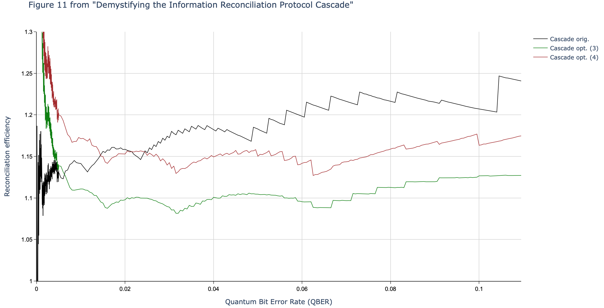
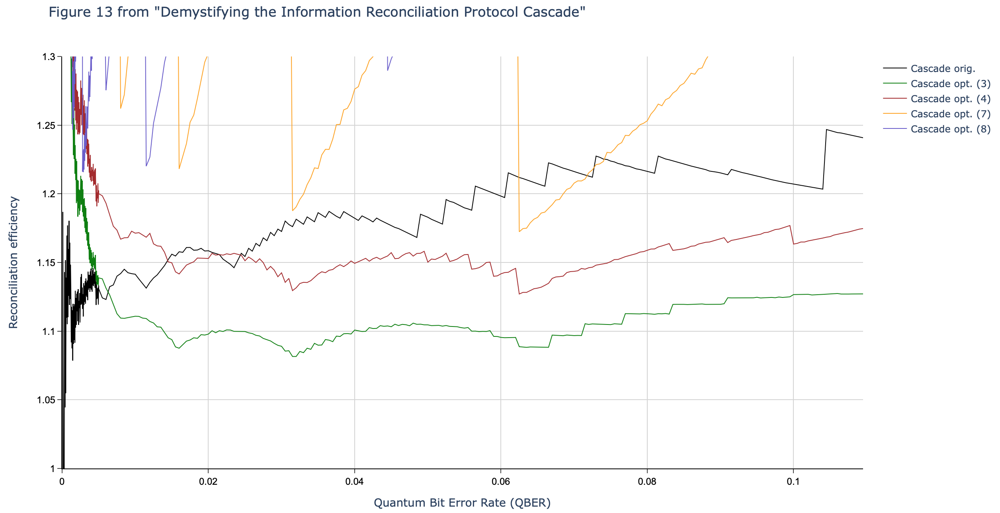
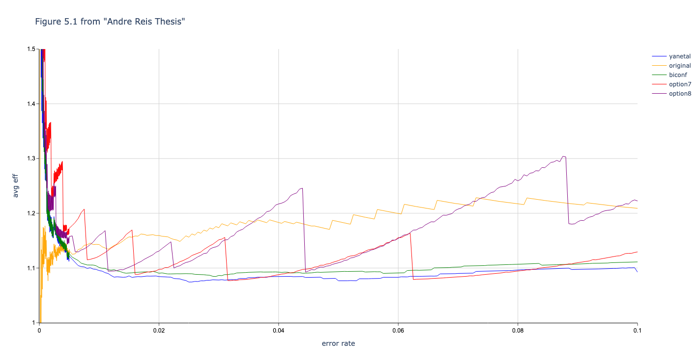
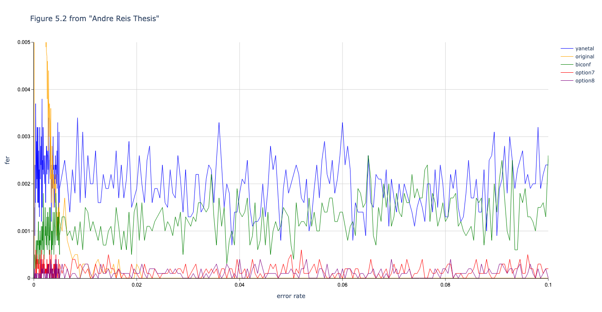

    

# What is Cascade-CPP?

[This repository](https://github.com/brunorijsman/cascade-cpp) contains a C++ implementation of
Cascade information reconciliation protocol for Quantum Key Distribution (QKD).

[This tutorial](https://cascade-python.readthedocs.io/en/latest/protocol.html) provides a detailed
description of the Cascade information reconciliation protocol and its relation to Quantum Key
Distribution.

# Comparison between Cascade-Python and Cascade-CPP

The C++ code in this repository is modeled after my earlier Python implementation in GitHub 
repository [Cascade-Python](https://github.com/brunorijsman/cascade-python), which
is documented on [ReadTheDocs](https://cascade-python.readthedocs.io/en/latest/).

The C++ code is orders of magnitude faster than the Python code. This is because the C++ code was
carefully optimized based on the insights from profiling the code. In particular, the decision to
cache Shuffle objects made a huge impact on the performance.

The "make data-papers" target in the Python code does 1,000 Cascade iterations per data point and
takes more than 5 days of continuous running on an AWS m5.2xlarge instance (120 hours x US$ 0.40 
per hour = US$ 48 in compute cost).
By contrast, the "make data-papers" target the C++ code does 10,000 Cascade iterations per data
point (10x better accuracy) only takes ten hours to complete (US$ 4).

The C++ was more carefully debugged than the Python code. The C++ code has a "make debug" target
that produces color-coded representations of the blocks at each step in the algorithm (bit errors
are shown in red). This makes it much easier to follow what is going on in the algorithm. Beyond
debugging, this is also a good tool for learning the Cascade algorithm.

As a result of the better debugging in the C++ code, the data produced by the C++ is more consistent
with the results published in
[Demystifying the Information Reconciliation Protocol Cascade](https://arxiv.org/abs/1407.3257)
and [Quantum Key Distribution Post Processing - A study on the Information Reconciliation Cascade Protocol](https://repositorio-aberto.up.pt/bitstream/10216/121965/2/347567.pdf).

# How to install, compile and run the Cascade-CPP code

To install on Ubuntu 18.04:

    git clone https://github.com/brunorijsman/cascade-cpp.git
    cd cascade-cpp
    sudo apt install -y make
    make ubuntu-get-dependencies

To build and run unit tests:

    make test

To build and run unit tests, and produce code coverage report in coverage/coverage-test.html (on a
Mac this also opens the coverage report in the browser):

    make test-coverage

To produce the data for all experiments:

    make data

To produce the data for specific set of experiments:

    # Choose one of these
    make data-papers
    make data-papers-subset
    make data-performance
    make data-zero-handling

To produce graphs, you need to have [Cascade-Python](https://github.com/brunorijsman/cascade-python)
installed in the $HOME/cascade-python directory.

The produce the graphs for specific set of experiments (this assumes that that the data has already
been produced):

    make graphs

To produce the graphs for all experiments:

    # Choose one of these
    make graphs-papers
    make graphs-performance
    make graphs-zero-handling

To run a small reconciliation with full debug prints:

    make debug

# Running experiments

Under the hood, when you issue `make data-papers` the Makefile executes the following command:

    bin/run_experiments study/experiments_papers.json --output-dir study/data/papers

The executable `run_experiments` does the following:

  1. It reads an experiments JSON file which describes which experiments to run.

  2. It runs the requested experiments in a multi-threaded fashion using all available CPU cores.

  3. It writes the results into one or more data JSON files that can later be visualized into
  graphs.

The executable `run_experiments` uses the following syntax:

    $ run_experiments --help
    Usage: run_experiments [options] experiments-file

    Options:
    --help                             Display help
    -d [ --disable-multi-processing ]  Disable multi-processing
    -m [ --max-runs ] arg              Maximum number of reconciliation runs per 
                                        data point
    -s [ --seed ] arg                  Random seed
    -o [ --output-directory ] arg      Output directory where to store data__* 
                                        files

Here is an example of an experiments JSON file (this is `experiments_papers.json`):

    [
        {
            "independent_variable": "error_rate",
            "algorithm": ["original", "biconf", "yanetal", "option3", "option4", "option7", "option8"],
            "error_rate": [
                {"start": 0.0000, "end": 0.0050, "step_size": 0.00005},
                {"start": 0.0050, "end": 0.1100, "step_size": 0.00050}
            ],
            "key_size": [1000, 2000, 10000],
            "runs": 10000
        },
        {
            "independent_variable": "key_size",
            "algorithm": ["original", "biconf", "yanetal", "option3", "option4", "option7", "option8"],
            "error_rate": 0.05,
            "key_size": {
                "start": 1e3,
                "end": 1e5,
                "step_factor": 1.05
            },
            "runs": 10000
        },
        {
            "independent_variable": "key_size",
            "algorithm": "original",
            "error_rate": [0.01, 0.02],
            "key_size": {
                "start": 1e3,
                "end": 1e5,
                "step_factor": 1.05
            },
            "runs": 10000
        }
    ]

The experiments JSON file consists of a list of records, each describing a single experiment. In
this example there are three experiments.

Each experiment has the following arguments.

 * `independent_variable`: This must be `error_rate` or `key_size`.

   * If it is set to `error_rate`, then one separate data file is produced for each requested
   `key_size` (for example `data__algorithm=option3;key_size=10000;error_rate=vary`) and the 
   `error_rate` is varied within each data file.

   * If it is set to `key_size`, then one separate data file is produced for each requested
   `error_rate` (for example `data__algorithm=option3;key_size=vary;error_rate=0.05`) and the
   `key_size` is varied within each data file.

 * `algorithm`: Either a single algorithm or a list of algorithms. Each algorithm is plotted as a line
in the graph. The available algorithms are `original`, `biconf`, `biconf-cascade`,
`biconf-no-complement`, `yanetal`, `option3`, `option4`, `option7`, and `option8`. See source
file `algorithm.cpp` for the detailed parameters for each algorithm. 

 * `error_rate`: The error rates to be used in the experiment in the form of a numerical list (see
 below).

 * `key_size`: The key sizes to be used in the experiment in the form of a numerical list (see
 below).

 * `run`: The number of reconciliation runs per data point in the results.

A numerical list is one of the following:

 * A list of numbers, for example `[1, 2, 3, 4]`

 * A linear range of numbers, for example `{"start": 100.0, "end": 200.0, "step": 5.0}`

 * A log range of numbers, for example `{"start": 10.0, "end": 10000.0, "step_factor": 3.0}`

 * A list of any of the above.

The executable `run_experiments` produces a set of data JSON files in the requested output
directory, for example:

    $ ls -1 study/data/papers/
    data__algorithm=biconf;key_size=10000;error_rate=vary
    data__algorithm=biconf;key_size=1000;error_rate=vary
    data__algorithm=biconf;key_size=2000;error_rate=vary
    data__algorithm=biconf;key_size=vary;error_rate=0.05
    ...
    data__algorithm=yanetal;key_size=2000;error_rate=vary
    data__algorithm=yanetal;key_size=vary;error_rate=0.05

Each data JSON file consists of a list of JSON records, one for each data point. Here is an
example data point record:

    {
        "actual_bit_error_rate": {"average": 0.000050, "deviation": 0.000050},
        "actual_bit_errors": {"average": 0.502200, "deviation": 0.502200},
        "algorithm_name": "biconf",
        "ask_parity_bits": {"average": 2828.808000, "deviation": 2828.808000},
        "ask_parity_blocks": {"average": 35.360100, "deviation": 35.360100},
        "ask_parity_messages": {"average": 37.360100, "deviation": 37.360100},
        "biconf_iterations": {"average": 10.000000, "deviation": 10.000000},
        "elapsed_process_time": {"average": 0.001794, "deviation": 0.001794},
        "elapsed_real_time": {"average": 0.001795, "deviation": 0.001795},
        "execution_time": "2020-04-08 20:20:49 UTC",
        "infer_parity_blocks": {"average": 6.919900, "deviation": 6.919900},
        "key_size": 10000,
        "normal_iterations": {"average": 2.000000, "deviation": 2.000000},
        "realistic_efficiency": {"average": 510.625974, "deviation": 510.625974},
        "reconciliations": 10000,
        "remaining_bit_error_rate": {"average": 0.000000, "deviation": 0.000000},
        "remaining_bit_errors": {"average": 0.000000, "deviation": 0.000000},
        "remaining_frame_error_rate": {"average": 0.000000, "deviation": 0.000000},
        "reply_parity_bits": {"average": 35.360100, "deviation": 35.360100},
        "requested_bit_error_rate": 0.000050,
        "unrealistic_efficiency": {"average": 4.495774, "deviation": 4.495774}
    }

# Producing graphs

We rely on the Python scripts in Cascade-Python to produce graphs from the results stored in the
data file produced by the executable `run_experiments`.

Under the hood, when you issue `make graphs-papers` the Makefile activates a Python3 virtual
environment and executes the following Python script:

	python $(CASCADE_PYTHON_DIR)/study/make_graphs.py study/graphs_demystifying.json \
		--data-dir study/data/papers

The graph JSON file (in this example `graphs_demystifying.json`) describes which variables
should be plotted in the graph and other attributes that influence the appearance of the graph.

This is an example of a graph file (namely the first graph in `graphs_demystifying.json`):

    [
        {
            "graph_name": "demystifying_figure_1",
            "title": "Figure 1 from \"Demystifying the Information Reconciliation Protocol Cascade\"",
            "x_axis": {
                "title": "Quantum Bit Error Rate (QBER)",
                "variable": "requested_bit_error_rate"
            },
            "y_axis": {
                "title": "Reconciliation efficiency",
                "variable": "unrealistic_efficiency",
                "range": [1.0, 1.3]
            },
            "series": [
                {
                    "data_file": "data__algorithm=original;key_size=10000;error_rate=vary",
                    "legend": "Cascade orig.",
                    "line_color": "black",
                    "deviation_color": "lightgray"
                },
                {
                    "data_file": "data__algorithm=biconf;key_size=10000;error_rate=vary",
                    "legend": "Cascade mod. (1)",
                    "line_color": "blue",
                    "deviation_color": "lightblue"
                }
            ]
        },
        ...
    ]

This produces the following graph:

# Comparing the data produced by Cascade-CPP with published literature.

In this section we compare the data produced

We used Github version
[c4d2194bcae4580f329597677ba2e2538bb53c81](https://github.com/brunorijsman/cascade-cpp/commit/c4d2194bcae4580f329597677ba2e2538bb53c81) (8 April 2020) of Cascade-CPP
to produce the data in these graphs.

## Comparison with Demystifying the Information Reconciliation Protocol Cascade.

In this section we compare the data produced by Cascade-CPP with the results reported in:

[Demystifying the Information Reconciliation Protocol Cascade](https://arxiv.org/abs/1407.3257). 
_Jesus Martinez-Mateo, Christoph Pacher, Momtchil Peev, Alex Ciurana, and Vicente Martin._  
arXiv:1407.3257 \[quant-ph\], Jul 2014.

### Figure 1.

Results reported in paper:

Results produced by Cascade-CPP:

### Figure 2.

Results reported in paper:

Results produced by Cascade-CPP:

### Figure 3.

Results reported in paper:

Results produced by Cascade-CPP:

### Figure 4.

Results reported in paper:

Results produced by Cascade-CPP:

### Figure 5.

Results reported in paper:

Results produced by Cascade-CPP:

### Figure 6.

Results reported in paper:

Results not produced by Cascade-CPP.

### Figure 7.

Results reported in paper:

Results not produced by Cascade-CPP.

### Figure 8.

Results reported in paper:

Results produced by Cascade-CPP:

### Figure 9.

Results reported in paper:

Results produced by Cascade-CPP:

### Figure 10.

Results reported in paper:

Results produced by Cascade-CPP:

### Figure 11.

Results reported in paper:

Results produced by Cascade-CPP:

### Figure 12.

Results reported in paper:

Results not produced by Cascade-CPP.

### Figure 13.

Results reported in paper:

Results produced by Cascade-CPP:

## Comparison with Quantum Key Distribution Post Processing.

In this section we compare the data produced by Cascade-CPP with the results reported in:

[Quantum Key Distribution Post Processing - A study on the Information Reconciliation Cascade Protocol.](https://repositorio-aberto.up.pt/bitstream/10216/121965/2/347567.pdf. 
_André Reis._ 
Master’s Thesis, Faculdade de Engenharia da Universidade do Porto, Jul 2019.

### Figure 5.1.

Results reported in thesis:

Results produced by Cascade-CPP:

### Figure 5.2.

Results reported in thesis:

Results produced by Cascade-CPP:

### Figure 5.3.

Results reported in thesis:

Results produced by Cascade-CPP:

### Figure 5.4.

Results reported in thesis:

Results not produced by Cascade-CPP.

### Figure 5.5.

Results reported in thesis:

Results produced by Cascade-CPP:

### Figure 5.6.

Results reported in thesis:

Results not yet produced by Cascade-CPP.

### Figure 5.7.

Results reported in thesis:

Results not yet produced by Cascade-CPP.

### Figure 5.8.

Results reported in thesis:

Results not yet produced by Cascade-CPP.

### Figure 5.9.

Results reported in thesis:

Results not yet produced by Cascade-CPP.

### Figure 5.10.

Results reported in thesis:

Results not yet produced by Cascade-CPP.
